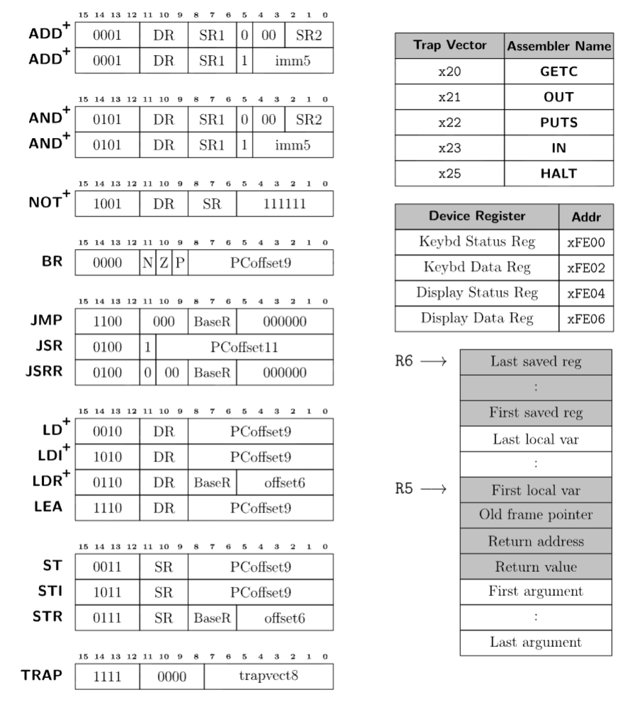

import Callout from '@/components/Callout.astro'
import diamondShape from './2.svg'
import triangleShape from './3.jpg'

## Introduction

I recently got around to finishing writing a decompiler for the LC3
architecture. I learned a lot and wanted to share my experience here. There
aren't many decompiler resources out there that start from scratch, so hopefully
this can be educational for someone.  The entire project is written in Rust and
about 4000 lines of code. The repo is available here:
https://github.com/RenchTG/lc3-decompiler.

## Resources

Before I write about the decompiler, I'd like to share some resources that were
particularly helpful for me in this process.

1. Decompiler Design by Giampiero Caprino:
https://www.backerstreet.com/decompiler/introduction.php
- This site was a great overview of standard decompilation techniques. I treated
it like a textbook and it explained the core concepts and algorithms needed
really well.
2. Decompilation Wiki: https://decompilation.wiki
- This wiki started by Zion Basque, a security researcher and CTF player, is a
great general resource and its fundamentals section in particular was very
helpful.

## The Architecture: LC3

LC3 is a simple, 16-bit RISC architecture with eight registers (R0-R7). It was
created by Patt and Patel and shown in their textbook: "Introduction to
Computing Systems: From Bits and Gates to C and Beyond". A wikipedia page with
more information can be found
[here](https://en.wikipedia.org/wiki/Little_Computer_3). The architecture is
taught in Georgia Tech's CS 2110 course which is an introduction to computer
architecture and this is where I was first exposed to it.

Here is a reference sheet with the instructions and some info on the calling
convention:


Note: Instructions marked with a + set condition codes, 1 bit each for negative,
zero, and positive.

Overall, the architecture is relatively simple and easy to understand. Due to
how simple it is though, it can sometimes take many instructions to perform a
single operation. For example, there is no subtraction instruction, so it
becomes a combination of NOT and ADDs.  Also, due to how few bits are in the pc
offset of memory-accessing instructions, oftentimes calls will need to be
indirect or instructions will need to load values from some predefined global
variables. However, I will describe these issues more in detail in later
sections.

<Callout title="Lack of compiler" variant="note">
LC3 does not actually have an official compiler. Now this may sound ridiculous
to write a decompiler for an architecture with no compiler (which it kind of
is), but it can still work well. However, issues show up especially when it
comes to things like the stack and calling convention, since these need to be
enforced by the programmer writing the assembly. Overall, this will make edge
cases more common, but the goal of this decompiler is not to be perfect, but to
demonstrate the decompilation process in LC3.
</Callout>

## Example program

As I walk through the steps of the decompiler, I will use the following program
as the example input. Here is the intended pseudocode:
```c
int minIndex = 0;
int minValue = ARRAY[0];
for (int i = 1; i < LENGTH; i++) {
    if (ARRAY[i] < minValue) {
        minValue = ARRAY[i];
        minIndex = i;
    }
}
mem[mem[RESULT]] = minIndex;
```

And here is the assembly:
```asm
AND R0, R0, 0   ; R0 = minIndex = 0
LDI R1, ARRAY   ; R1 = minValue = ARRAY[0]
AND R2, R2, 0
ADD R2, R2, 1   ; R2 = i = 1

FORSTART
AND R3, R3, 0
ADD R3, R2, 0   ; R3 = i
LD R4, LENGTH
NOT R4, R4
ADD R4, R4, 1   ; R4 = -length
ADD R3, R3, R4  ; R3 = i - length
BRZP FOREND

LD R3, ARRAY
ADD R3, R3, R2  ; R3 = addr of array[i]
LDR R3, R3, 0   ; R3 = array[i]
AND R4, R4, 0
ADD R4, R4, R1
NOT R4, R4
ADD R4, R4, 1   ; R4 = -minValue
AND R5, R5, 0
ADD R5, R3, R4  ; R5 = array[i] - minValue
BRZP NOTIF
AND R1, R1, 0
ADD R1, R1, R3  ; minValue = array[i]
AND R0, R0, 0
ADD R0, R0, R2  ; minIndex = i
NOTIF
ADD R2, R2, 1
BR FORSTART
FOREND
STI R0, RESULT
HALT

RESULT .fill x4000
ARRAY .fill x5000
LENGTH .fill 5
.end

.orig x4000
    ANSWER .blkw 1
.end

.orig x5000
    .fill -1
    .fill 2
    .fill 7
    .fill 3
    .fill -8
.end
```

## Step 1: Disassembly

I wanted the decompiler to take object files as input, so the first step would
be to disassemble.

Object files have two sections that I am interested in .TEXT and .SYMBOL. They
look like this:

```text
.TEXT
3000
32
5020
A21C
54A0
14A1
...
```

```text
.SYMBOL
ADDR | EXT | LABEL
3004 |   0 | FORSTART
3019 |   0 | NOTIF
301B |   0 | FOREND
...
```

These object files are created by the assembler and can then be passed into a
simulator. I utilized lc3-ensemble which is a library written by one of the CS
2110 TAs and it can be found
[here](https://github.com/endorpersand/lc3-ensemble).  It has some nice helper
functions and structures that make working with the assembly a lot easier.

Now parsing the object file and symbol table is very simple, the only issues
arise during disassembly. Since there is no separation between code and data in
LC3 object files, there is no trivial way to tell the difference. Luckily, this
is not a problem that occurs only in LC3, it is just particularly worse in our
situation since there is no notion of a data section, so ALL variables must live
among code.

The decompiler design resource has a section on "Identifying Code and Data"
which can be found
[here](https://www.backerstreet.com/decompiler/code_data.php). Essentially, we
will begin at the entrypoint which is passed in as an argument to the decompiler
(by default it is 0x3000). Then we disassemble instructions one by one. Some
special cases exist:
- If we see a branch, add the destination address to the worklist to visit later
and fall through
- If we see a call, add the destination address to a separate call list and fall
through
- If we see a return or halt, we end and pop the next item from the worklist
- There are also indirect jumps (JMP reg), in this case the destination is
unknown so we treat it like a terminator
- All unvisited addresses are treated as data.

The output of this stage is a map of addresses to instructions/data and a list
of function entrypoints identified. For the example program, here is the output
of this stage:
```text
Disassembly:
3000: AND R0, R0, #0
3001: LDI R1, #28
3002: AND R2, R2, #0
3003: ADD R2, R2, #1
3004: FORSTART AND R3, R3, #0
3005: ADD R3, R2, #0
3006: LD R4, #24
3007: NOT R4, R4
3008: ADD R4, R4, #1
3009: ADD R3, R3, R4
300A: BRzp #16
300B: LD R3, #18
300C: ADD R3, R3, R2
300D: LDR R3, R3, #0
300E: AND R4, R4, #0
300F: ADD R4, R4, R1
3010: NOT R4, R4
3011: ADD R4, R4, #1
3012: AND R5, R5, #0
3013: ADD R5, R3, R4
3014: BRzp #4
3015: AND R1, R1, #0
3016: ADD R1, R1, R3
3017: AND R0, R0, #0
3018: ADD R0, R0, R2
3019: NOTIF ADD R2, R2, #1
301A: BRnzp #-23
301B: FOREND STI R0, #1
301C: HALT
301D: RESULT JSRR R0
301E: ARRAY AND R0, R0, R0
301F: LENGTH .fill #5
4000: ANSWER .fill #0
5000: .fill #65535
5001: .fill #2
5002: .fill #7
5003: .fill #3
5004: .fill #65528

Identified functions:
3000
```

## Step 2: Building the CFG

Now the next step is to create a control flow graph of basic blocks. The
decompiler design resource has two relevant sections titled "Basic Blocks" and
"Control Flow Graph" which can be found
[here](https://www.backerstreet.com/decompiler/basic_blocks.php) and
[here](https://www.backerstreet.com/decompiler/control_flow_graph.php)
respectively.

Basic blocks are simply sequences of instructions that we can guarantee can only
be entered through the first instruction and exited through the last. To ensure
our basic blocks have only one entry and exit, we will terminate a block using
the nearest label or branch instruction. We know where labels are from our
symbol table and branches can be found simply by looking through the
disassembly. We then link predecessors and successors by looking at the last
instruction of a block. Unconditional branches will have one target, conditional
branches two, and rets/halts/indirect jumps will have none.

One more piece of information that is important to track for our blocks is
dominators. This will help us better understand the control flow and detect
loops more easily later on. Essentially, block A dominates block B if every path
from the entrypoint to block B must pass through block A. An algorithm for
computing dominators is also described at the start of the "Loop Analysis"
section of the decompiler design resource found
[here](https://www.backerstreet.com/decompiler/loop_analysis.php).

Our algorithm begins by initializing the entry block's dominator set as itself
and all other blocks' sets as every block dominating them. Then, for each
non-entry block we update its dominator set to be the intersection of its set
and its predecessors' dominator sets. We repeat this process until no more sets
change.

To store all of this information we create a BasicBlock struct:
```rust
pub struct BasicBlock {
    pub length: u16,
    pub preds: Vec<u16>,
    pub succs: Vec<u16>,
    pub dominators: Vec<u16>,
}
```

Now, we can output a mapping of address to basic blocks that we have found along
with their properties. For our example program, the output of this stage is:
```text
Basic blocks:
Block at 3000: length = 4, preds = [], succs = [3004], dominators = [3000]
Block at 3004: length = 7, preds = [3000, 3019], succs = [301B, 300B], dominators = [3000, 3004]
Block at 300B: length = 10, preds = [3004], succs = [3019, 3015], dominators = [3000, 3004, 300B]
Block at 3015: length = 4, preds = [300B], succs = [3019], dominators = [3000, 3004, 300B, 3015]
Block at 3019: length = 2, preds = [300B, 3015], succs = [3004], dominators = [3000, 3004, 300B, 3019]
Block at 301B: length = 2, preds = [3004], succs = [], dominators = [3000, 3004, 301B]
```

## Step 3: Control Flow Identification

The next stage is to start identifying higher level control flow structures,
namely loops and conditionals. The decompiler design resource does this in the
second half of the "Loop Analysis" section found
[here](https://www.backerstreet.com/decompiler/loop_analysis.php) and the
"Creating Statements" section
[here](https://www.backerstreet.com/decompiler/creating_statements.php).

We start by identifying natural loops by detecting back edges in the CFG. Here,
back edges are defined as edges where the target block dominates the source
block. For each back edge found, we work backwards from the tail and add any
blocks that can reach the tail without going through the header, thus adding
blocks to the loop body.

For our example program, the output of this stage is:
```text
Natural loops:
Loop 1: header = 3004, blocks = [3019, 3004, 300B, 3015]
```

Next, we improve our natural loops to add more information.
- First, we merge
natural loops with the same header. This allows for the creation of compound
conditions like `while (a && b)`.
- Next, we sort loops from innermost to
outermost, so nested loops are handled correctly.
- Finally, we identify key
blocks which are the break and continue blocks. A break block is the first
successor outside the loop body (the destination of high level break statements)
and a continue block is the block containing the back edge (the destination of
high level continue statements).

To store this information, we create a new Loop struct:
```rust
pub struct Loop {
    pub header: u16,
    pub blocks: HashSet<u16>,
    pub break_block: Option<u16>,
    pub continue_block: Option<u16>,
}
```

The output of this stage is a list of Loop objects. For our example program, the
output is:
```text
Identified Loop Structures:
Loop 1: header = 3004, blocks = [3019, 3004, 300B, 3015], break_block = Some("301B"), continue_block = Some("3019")
```

Finally, we identify conditionals. We use two main patterns the classic if-else
diamond shape and the simple if structure:

<div class="flex items-center justify-center gap-4">
  
  
</div>

The if-else structure in code:

```text
   if(expr)                     if(!expr) {
      goto Lfalse
   ....                             ....
   goto Lelse                   }
Lfalse:                         else {
   ....                             ....
Lelse:                          }
   ....                         .... 
```

And the simple if structure:
```text
   if(expr)                     if(!expr) {
      goto Lfalse
   ....                             ....
Lfalse:                         }
```

These are found easily by iterating through our blocks and analyzing their
successors. For example, if a block has two successors and both join to a single
block, then it is an if-else structure. To house this information we create a
Conditional struct:
```rust
pub struct Conditional {
    pub kind: ConditionalType,
    pub condition_block: u16,
    pub true_block: u16,
    pub false_block: Option<u16>,
    pub join_block: u16,
}
```

For our example program, the output of this step is:
```text
Identified Conditional Structures:
Conditional 1 (If): condition_block = 300B, true_branch = 3015, join_block = 3019
```

<Callout title="Why not structuring?" variant="important">
At this point in decompilation, we have only identified structures and stored
them separately in their respective data structures. There are many reasons for
this, but the primary reason is that we need to create the contents of
loop/conditional expressions during structuring. For example, even a loop with a
simple condition of while (a < b) will require many instructions to compute a -
b to set condition codes for the conditional branch.  How do we know which
instructions are part of this condition and which aren't?  This is what we will
address in the next stage before we return to control flow structuring.
</Callout>

## Step 4: Liveness and Dataflow Analysis

Onto data flow analysis. The goal here is to start analyzing arithmetic
instructions. We will try to remove as many register references as possible and
collapse instructions where it is safe to do so. The section "Data Flow
Analysis" of the decompiler design resource covers this
[here](https://www.backerstreet.com/decompiler/data_flow.php).

What we will do is calculate the "livein" and "liveout" sets for each
instruction. These are the registers that are alive before executing the
instruction and after executing the instruction, respectively. This will be
stored as a bit vector where each bit represents a register. We will use this
information later to collapse instructions as we will know which registers are
not needed later and can be safely inlined or removed.

This process will happen in three phases:

1. **Compute liveness information for each basic block without considering its
relationship to other basic blocks.**

Here, we look through each instruction and check what registers are written to
(defs) and which registers are read from (uses). Then on the block level, we
compute block uses as registers used before being defined in the block and
block defs as registers defined anywhere in the block.

```text
Use[B] |= (uses & !block_def)
Def[B] |= defs
```

2. **Propagate liveness information from each block to all other blocks in the
CFG.**

Here, we use a fixed-point iteration algorithm to calculate a block's liveout
set as the union of the livein sets of all its successors and a block's livein
set as the union of its block uses and its liveout set minus its block defs.

```text
Out[B] = ∪ In[S] for all successors S
In[B] = Use[B] ∪ (Out[B] - Def[B])
```

3. **Add information collected from other blocks to each instruction present in a
block.**

Here, we know which registers are live at the boundaries of each block, but not
per instruction. So, we walk backwards through each block and apply block-level
liveness information to each instruction with the following algorithm:

```text
live_out[instr] = current_live
live_in[instr] = uses[instr] ∪ (live_out[instr] - defs[instr])
current_live = live_in[instr]
```

The output of this stage is a map of instruction addresses to their use, def,
livein, and liveout sets. For our example program, this looks like:
```text
Liveness Analysis:
3000: defs=01, uses=00, in=00, out=01
3001: defs=02, uses=00, in=01, out=03
3002: defs=04, uses=00, in=03, out=07
3003: defs=04, uses=04, in=07, out=07
3004: defs=08, uses=00, in=07, out=07
3005: defs=08, uses=04, in=07, out=0F
3006: defs=10, uses=00, in=0F, out=1F
3007: defs=10, uses=10, in=1F, out=1F
3008: defs=10, uses=10, in=1F, out=1F
3009: defs=08, uses=18, in=1F, out=07
300A: defs=00, uses=00, in=07, out=07
300B: defs=08, uses=00, in=07, out=0F
300C: defs=08, uses=0C, in=0F, out=0F
300D: defs=08, uses=08, in=0F, out=0F
300E: defs=10, uses=00, in=0F, out=1F
300F: defs=10, uses=12, in=1F, out=1F
3010: defs=10, uses=10, in=1F, out=1F
3011: defs=10, uses=10, in=1F, out=1F
3012: defs=20, uses=00, in=1F, out=1F
3013: defs=20, uses=18, in=1F, out=0F
3014: defs=00, uses=00, in=0F, out=0F
3015: defs=02, uses=00, in=0C, out=0E
3016: defs=02, uses=0A, in=0E, out=06
3017: defs=01, uses=00, in=06, out=07
3018: defs=01, uses=05, in=07, out=07
3019: defs=04, uses=04, in=07, out=07
301A: defs=00, uses=00, in=07, out=07
301B: defs=00, uses=01, in=01, out=00
301C: defs=00, uses=00, in=00, out=00
```

## Step 5: IR Lifting and Expression Propagation

Now that we have liveness information, we can safely inline instructions where
possible. In the process, we will also lift instructions into an IR that is
mostly composed of Assigns, Stores, Gotos, and Expressions. This step is covered
in the "Expressions Propagation" section of the decompiler design resource found
[here](https://www.backerstreet.com/decompiler/expression_propagation.php).

Essentially, we will go through our assignment instructions one by one and add
them as "pending assignments". When the assigned register is later used, if it
is dead after use we can inline the assignment. Otherwise, we must flush the
assignment and use a register reference where it is used.

Once this is complete, we will have many inlined expressions together for
individual IR assignments. This lets us collapse them with some standard
identities. We run this in a fixed-point loop until no more simplifications can
be made.

| Pattern | Simplification |
| --- | --- |
| Not(Not(x)) | x |
| And(x, 0) | 0 |
| Add(Not(x), 1) | Neg(x) |
| ... | ... |

We also do a quick pass to attach condition expressions to Goto statements.
Similar to how we collapse assignments, if we see a register is dead after its
assignment right before a goto, we know it was only used to set condition codes.
So, we simply attach the condition expression to the goto statement and remove
the assignment.

The output of this stage is a map of addresses to IR assignments, categorized
within their basic blocks. For our example program, here is the output IR before
and after collapsing assignments:

```text
Expressions:
Block 3000:
  3000: Assign(0, And(Register(0), Immediate(0x0)))
  3001: Assign(1, Load(Load(Immediate(0x301E))))
  3003: Assign(2, Add(And(Register(2), Immediate(0x0)), Immediate(0x1)))
Block 3004:
  3009: Assign(3, Add(Add(Register(2), Immediate(0x0)), Add(Not(Load(Immediate(0x301F))), Immediate(0x1))))
  300A: Goto(None, 0x3, 0x301B)
Block 300B:
  300D: Assign(3, Load(Add(Add(Load(Immediate(0x301E)), Register(2)), Immediate(0x0))))
  3013: Assign(5, Add(Register(3), Add(Not(Add(And(Register(4), Immediate(0x0)), Register(1))), Immediate(0x1))))
  3014: Goto(None, 0x3, 0x3019)
Block 3015:
  3016: Assign(1, Add(And(Register(1), Immediate(0x0)), Register(3)))
  3018: Assign(0, Add(And(Register(0), Immediate(0x0)), Register(2)))
Block 3019:
  3019: Assign(2, Add(Register(2), Immediate(0x1)))
  301A: Goto(None, 0x7, 0x3004)
Block 301B:
  301B: Store(Load(Immediate(0x301D)), Register(0))
```

```text
Collapsed Expressions:
Block 3000:
  3000: Assign(0, Immediate(0x0))
  3001: Assign(1, Load(Load(Immediate(0x301E))))
  3003: Assign(2, Immediate(0x1))
Block 3004:
  300A: Goto(Some(Sub(Register(2), Load(Immediate(0x301F)))), 0x3, 0x301B)
Block 300B:
  300D: Assign(3, Load(Add(Load(Immediate(0x301E)), Register(2))))
  3014: Goto(Some(Sub(Register(3), Register(1))), 0x3, 0x3019)
Block 3015:
  3016: Assign(1, Register(3))
  3018: Assign(0, Register(2))
Block 3019:
  3019: Assign(2, Add(Register(2), Immediate(0x1)))
  301A: Goto(None, 0x7, 0x3004)
Block 301B:
  301B: Store(Load(Immediate(0x301D)), Register(0))
```

## Step 6: Control Flow Structuring

Now we can return to creating control flow structures we identified earlier.
This is covered in the "Creating Statements" section of the decompiler design
resource found
[here](https://www.backerstreet.com/decompiler/creating_statements.php).

I broke this process down into five steps:

1. **Merge Compound Conditions**

This is done first, since it is easier to detect these patterns before any loop
structures are fully created yet. This way once we have created a loop with an
expression, we can be relatively confident there are no other checks or boolean
expressions.

I'm not sure if there's a sophisticated algorithm for this, but I just looked
for consecutive gotos with the same target address. Most of this came from
simply testing examples and trying to detect the most common patterns. By the
end, any adjacent conditionals are combined together with a LogicalOr expression
type.

For example, patterns like:
```text
if (cond1) goto L_false;
if (cond2) goto L_false;
// ... true path ...
```

Become: `if (cond1 || cond2) goto L_false`

2. **Structure Loops**

Now it is time to create loop structures using the following steps:
- Use the already computed natural loops and for each one create a DoWhile
statement in the IR
- Take all blocks in the loop body and move them into the statement
- Find the goto that exits to the break block and negate it to create the
condition
- Remove this goto since it is now implicit
- Any gotos with a destination of the break block become break statements
- Any gotos with a destination of the continue block become continue statements

The DoWhile statement in the IR is defined as:
```rust
DoWhile(Option<Expr>, u8, HashMap<u16, Vec<IRStmt>>)
```

Where the `Option<Expr>` is the condition, the `u8` is the condition code, and
the `HashMap<u16, Vec<IRStmt>>` is the loop body.

3. **Structure Conditionals**

Now we can create if/if-else statements. Most of the work here was already done
in the identification step. For if-else patterns, we extract the true and false
blocks and put it in our IR statements. For simple if patterns, we just extract
the true block. This process also happens recursively to descend into any loop
bodies first.

The If statement in the IR is defiend as:
```rust
If(Option<Expr>, u8, Vec<IRStmt>, Option<Vec<IRStmt>>)
```

Where the `Option<Expr>` is the condition, the `u8` is the condition code, the
`Vec<IRStmt>` is the true block, and the `Option<Vec<IRStmt>>` is the false
block which is None in the simple if case.

4. **Refine Loops**

Now in our loop structuring we assumed all loops are do whiles by default. This
step will create while loops and for loops where appropriate. First we convert
do while loops to while loops based on the following pattern:
```text
   if(expr)                         while(expr) {
      goto Lbreak;
   do {
      ....                              ....
   } while(expr);                   }
Lbreak:
   ....                             ....
```

<Callout title="Why conditionals were structured first" variant="note">
Hopefully this makes it clear why we structured conditionals before refining our
loops. It becomes much easier to detect the while loop pattern as an if above a
do while loop. Both check the same condition.
</Callout>

Then we convert while loops to for loops based on the following pattern. An
initialization statement must be present in the predecessor block, that same
variable must be used in the condition, and that variable is also incremented at
the end of the loop body.
```text
   v = init_expr
   while(expr comparing v) {       for(v = init_expr; expr comparing v; v = incr) {
      ....
Lcontinue:
      v = incr // e.g. v += 1
   }                               }
   ....
```

5. **Cleanup Control Flow**

One last step is to remove certain redundant statements. There will often be
continues at the end of a loop body that are not needed or unnecessary gotos
that fall through a conditional. These become easier to detect once our loops
are in their fully structured form (while, do while, for).

The output of this stage is similar to our collapsed expression from the
previous stage, but now certain statements are nested inside of control flow
structures and rearranged. For our example program, this looks like:

```text
Structured Control Flow:
Block 3000:
  3000: Assign(0, Immediate(0x0))
  3001: Assign(1, Load(Load(Immediate(0x301E))))
Block 3004:
  3004: For(Assign(2, Immediate(0x1)), Some(Sub(Register(2), Load(Immediate(0x301F)))), 0x4, Assign(2, Add(Register(2), Immediate(0x1))), {
  Block 3004:
  Block 300B:
    Assign(3, Load(Add(Load(Immediate(0x301E)), Register(2))))
    If(Some(Sub(Register(3), Register(1))), 0x4, {
    Assign(1, Register(3))
    Assign(0, Register(2))
  })
  Block 3019:
})
Block 301B:
  301B: Store(Load(Immediate(0x301D)), Register(0))
```

## Step 7: Handling Calling Convention

Before we finish, we need to take one last detour regarding calling conventions.
I ran into some trouble here since not all test programs I had followed this
convention strictly, especially the simpler tests. I ended up making this an
optional argument that can be passed into the decompiler. 

There are two main cases that we have to handle for the caller and the callee.

1. **Callee**

There are three main issues here that make the current decompilation quite ugly
for functions being called. 
- Prologue: There are many instructions involved in setting up the stack frame
and saving registers. We essentially look for the last instruction that saves a
general purpose register and clear all instructions before it.
- Epilogue: There is also callee teardown. This one is easier to detect since
the first instruction always saves the return value at some offset from R5. We
simply remember which register is used for the return value, remove all
instructions after it, and insert a single `return varX` statement.
- Parameter Passing: Lastly, anytime function parameters are used they are
loaded from R5+4, R5+5, etc. We simply replace these with more recognizable
`paramX` names where X is the parameter's index.

2. **Caller**

In LC3 when a function is called, first parameters are pushed onto the stack,
then the call is executed, and then the return value is popped off the stack and
the stack pointer is restored. Ideally, we want calls to be condensed to just
one instruction like `varX = func(param0, param1)`.

Push sequences subtract from the stack pointer and store, so the parameters
pushed are stored and these instructions are removed. After a function call, we
simply look for the load instruction that grabs the return value and the add
that fixes the stack pointer. We track the register storing the return value and
remove these instructions.

Here is an example of a fibonacci function implementation run with and without
the calling convention argument:

```text
Structured Control Flow:
Block 4000:
  4001: Assign(6, Add(Register(6), Immediate(0xFFFE)))
  4002: Store(Register(6), Register(7))
  4003: Assign(6, Add(Register(6), Immediate(0xFFFF)))
  4004: Store(Register(6), Register(5))
  4007: Assign(6, Add(Register(6), Immediate(0xFFFD)))
  4008: Store(Register(6), Register(0))
  4009: Assign(6, Add(Register(6), Immediate(0xFFFF)))
  400A: Store(Register(6), Register(1))
  400B: Assign(6, Add(Register(6), Immediate(0xFFFF)))
  400C: Store(Register(6), Register(2))
  400D: Assign(6, Add(Register(6), Immediate(0xFFFF)))
  400E: Store(Register(6), Register(3))
  400F: Assign(0, Load(Add(Add(Register(6), Immediate(0xFFFF)), Immediate(0x4))))
  4010: Assign(2, Add(Register(0), Immediate(0xFFFF)))
  4011: If(Some(Register(2)), 0x1, {
    Assign(0, Register(2))
    Assign(6, Add(Register(6), Immediate(0xFFFF)))
    Store(Register(6), Register(0))
    Call(Immediate(0x4000))
    Assign(3, Load(Register(6)))
    Assign(6, Add(Register(6), Immediate(0x1)))
    Store(Register(6), Add(Register(0), Immediate(0xFFFF)))
    Call(Immediate(0x4000))
    Assign(6, Add(Register(6), Immediate(0x2)))
    Assign(1, Add(Register(3), Load(Register(6))))
  } else {
    Assign(1, Register(0))
  })
Block 4023:
  4023: Store(Add(Register(5), Immediate(0x3)), Register(1))
  4024: Assign(3, Load(Register(6)))
  4025: Assign(6, Add(Register(6), Immediate(0x1)))
  4026: Assign(2, Load(Register(6)))
  4027: Assign(6, Add(Register(6), Immediate(0x1)))
  4028: Assign(1, Load(Register(6)))
  4029: Assign(6, Add(Register(6), Immediate(0x1)))
  402A: Assign(0, Load(Register(6)))
  402C: Assign(6, Add(Register(6), Immediate(0x3)))
  402D: Assign(5, Load(Register(6)))
  402E: Assign(6, Add(Register(6), Immediate(0x1)))
  402F: Assign(7, Load(Register(6)))
  4030: Assign(6, Add(Register(6), Immediate(0x1)))
  4031: Return
```

```text
Structured Control Flow:
Block 4000:
  400F: Assign(0, Param(0))
  4010: Assign(2, Add(Register(0), Immediate(0xFFFF)))
  4011: If(Some(Register(2)), 0x1, {
    Assign(0, Register(2))
    Assign(3, CallExpr(Immediate(0x4000), Register(0)))
    Assign(1, Add(Register(3), CallExpr(Immediate(0x4000), Add(Register(0), Immediate(0xFFFF)))))
  } else {
    Assign(1, Register(0))
  })
Block 4023:
  4031: Return(Register(1))
```

## Step 8: Linearization and Code Output

We are so close to the end, but our IR at this point is stored as map of
addresses to IRStmts. We need to remove any notion of addresses and blocks to
output a clean vector of statements.

Here, we simply sort blocks by address and output statments one by one. We do
need to keep track of any gotos that we were not able to turn into some control
flow statement. In this case, we preserve its destination label and output it at
the right address. Finally, we also do this recursively to properly handle
nested loops and conditionals.

After linearization is also a good time to do any miscellaneous cleanup. If
certain control flow structures were hard to detect earlier or if there are any
unnecessary labels we can remove them now.

This will output a vector of linearized code. For our example program, this
looks like:

```text
Linearized Code:
Assign(0, Immediate(0x0))
Assign(1, Load(Load(Immediate(0x301E))))
For(Assign(2, Immediate(0x1)), Some(Sub(Register(2), Load(Immediate(0x301F)))), 0x4, Assign(2, Add(Register(2), Immediate(0x1))), {
    Assign(3, Load(Add(Load(Immediate(0x301E)), Register(2))))
    If(Some(Sub(Register(3), Register(1))), 0x4, {
    Assign(1, Register(3))
    Assign(0, Register(2))
  })
})
Store(Load(Immediate(0x301D)), Register(0))
```

Finally, we convert these statements one by one to C-like syntax. Registers
become varX where X is the register number, arithmetic operations become their
respective symbols, accessing memory becomes pointer dereferencing, etc. Also,
loop headers and conditionals up until now still stored their condition code
number, so we need to convert the bits of NZP to their respective comparison
symbols. This process is partly up to personal preference, so I won't go into
detail about it here.

One last step to make our code output even better for LC3 is to use the symbol
table we extracted from the object file earlier. Any references that load,
store, or call some address present in the symbol table can be resolved to their
respective names.

The output is simply the string containing the code. For our example program, it
looks like:

```c
Generated C-Like Code:
var0 = 0;
var1 = *(*ARRAY);
for (var2 = 1; var2 < *LENGTH; var2++) {
    var3 = *(*ARRAY + var2);
    if (var3 < var1) {
        var1 = var3;
        var0 = var2;
    }
}
**RESULT = var0;
```

## Conclusion

If we compare the output to the intended pseudocode, we can see it is nearly the
same.

```c
int minIndex = 0;
int minValue = ARRAY[0];
for (int i = 1; i < LENGTH; i++) {
    if (ARRAY[i] < minValue) {
        minValue = ARRAY[i];
        minIndex = i;
    }
}
mem[mem[RESULT]] = minIndex;
```

This decompiler is by no means perfect. Ideally, many of these stages would be
repeated since they usually make the final result much more accurate. This is
mentioned in the "Standard Decompiler Architecture" section of the decompiler
design resource found
[here](https://www.backerstreet.com/decompiler/decompiler_architecture.php)
where it mentions "We'll see in the advanced section that it is not possible to
perform advanced decompilation in a single pass over the input program. The use
of multiple passes may make some analysis more complicated, but it will give
much better results."

The biggest issues I am aware of are that any indirect jumps or calls are not
handled at all. The calling convention is also handled very naively, so local
variables are not detected. Some code could also be better optimized to remove
unnecessary assignments.

Overall though, I'm very satisfied with the result and think this project helped
me understand the decompilation process much better which oftentimes feels very
black boxy. If you read this far thanks for sticking around and I hope you
learned something new!
